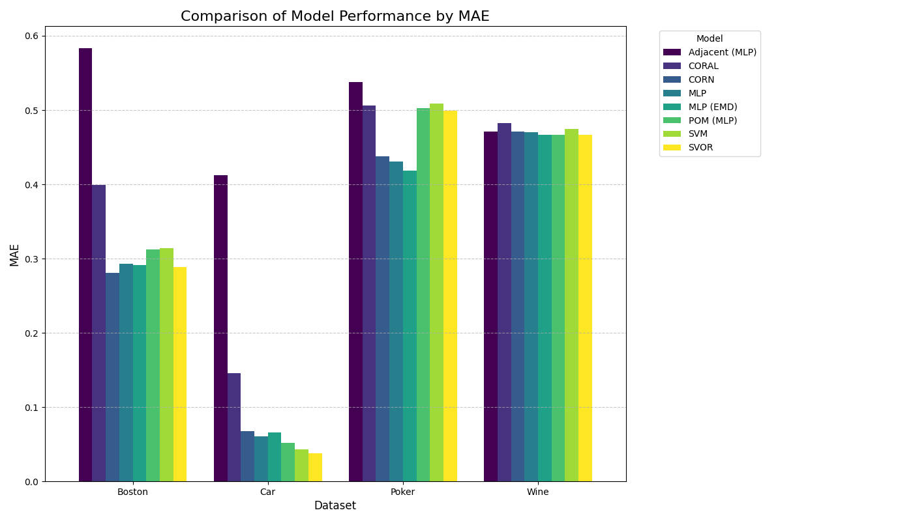
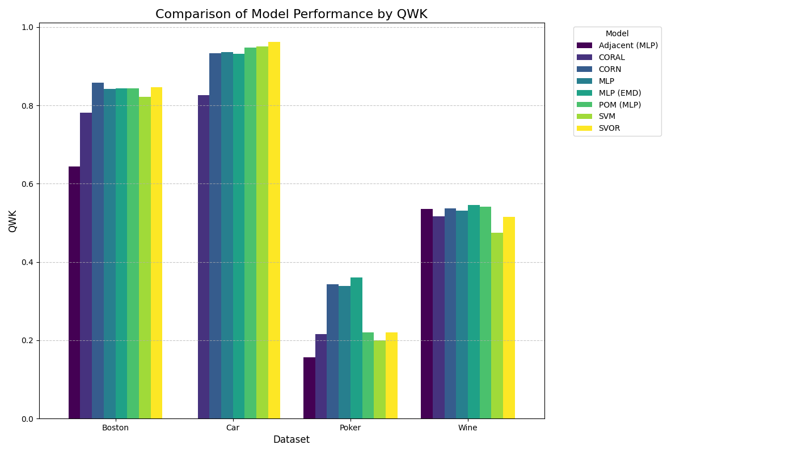
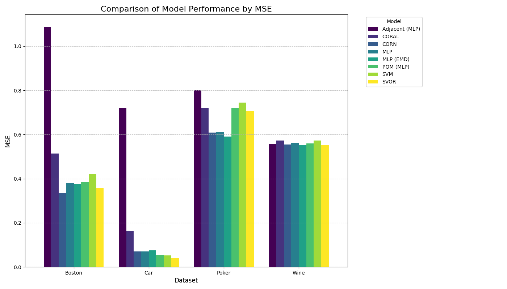
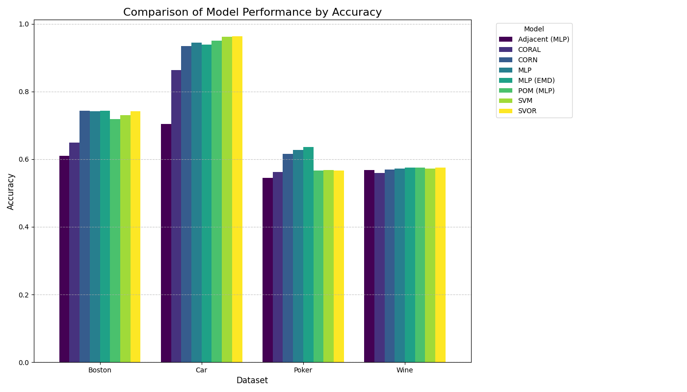
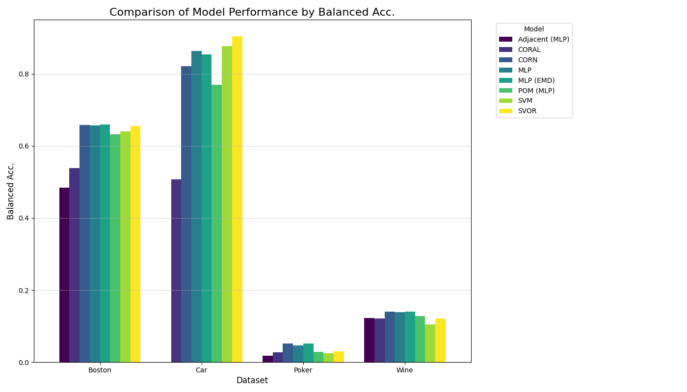

# Survey on Ordinal Classification

**Jesse Wood, Member, IEEE, Bach Nguyen, Member, IEEE, Bing Xue, Fellow, IEEE, Mengjie Zhang, Fellow, IEEE, Daniel Killeen, Member, IEEE**

> This manuscript was submitted on the 27th of October 2025. This work was supported by the MBIE Fund on Research Program under contract C11X2001.
> J. Wood, B. Nguyen, B. Xue, M. Zhang are associated with the Center for Data Science and Artificial Intelligence (CDSAI) at Victoria University of Wellington, Kelburn Parade, Wellington, 6012, New Zealand
> D. Killen is associated with the Seafood Technologies department of Plant and Food Research New Zealand, Akerston Street, Nelson, 7010, New Zealand
> This paragraph will include the Associate Editor who handled your paper.

## Abstract

Ordinal classification, or ordinal regression, is a unique supervised learning task where the target variable's categories possess a natural order. This problem is distinct from nominal classification, which ignores order, and metric regression, which assumes equidistant categories. This review surveys the primary families of methods developed to address this challenge, categorizing them into threshold-based models, binary decomposition approaches, and modern deep learning techniques. We discuss the key models within each family, analyze their respective strengths and limitations, and review the standard evaluation metrics for a rigorous comparison. Finally, we highlight significant open challenges and outline promising directions for future research.

## Impact Statement

This review provides a comprehensive and structured overview of the field of ordinal classification, a critical task in many real-world applications such as medicine, social science, and sentiment analysis. By categorizing the diverse methodologies, from classic statistical models to modern deep learning approaches, this work serves as an essential resource for researchers and practitioners. It lowers the barrier to entry for new researchers, helps experienced practitioners select the most appropriate model for their problem, and identifies key open challenges, thereby guiding future research toward areas of greatest need and potential impact.

**Keywords:** Ordinal Classification, Ordinal Regression, Literature Review, Machine Learning, Threshold Models, Deep Learning, Evaluation Metrics

## 1. Introduction

In many real-world machine learning problems, from medical diagnoses to customer satisfaction surveys, the target variable is not just a set of discrete categories but a set of *ordered* categories. This fundamental distinction forms the basis of ordinal classification, the subject of this review. This section will define the core problem, highlight its importance, and outline the structure of the paper.

This section introduces the concept of ordinal classification and sets the stage for the review.

### 1.1 Definition of Ordinal Classification

Ordinal classification, also known as ordinal regression, is a type of supervised learning problem where the goal is to assign instances to categories that have a natural, inherent order. Formally, given an input instance described by a feature vector $X \in \mathbb{R}^d$, the task is to predict its corresponding target label $Y$, which belongs to a finite set of $k$ ordered categories, denoted as {$C_1, C_2, ..., C_k$}, such that a meaningful ordering relationship exists: $C_1 \prec C_2 \prec ... \prec C_k$.

This task occupies a unique space between standard classification and regression:

- **Contrast with Nominal Classification:** Unlike nominal classification problems where categories are distinct but unordered (e.g., classifying images as `cat`, `dog`, or `bird`), the order between categories in ordinal classification holds significant meaning (e.g., `low`, `medium`, `high` risk). Ignoring this order, as nominal classifiers do, results in a loss of valuable information.
- **Contrast with Metric Regression:** While both ordinal classification and metric regression deal with ordered outcomes, metric regression assumes that the target variable is measured on at least an interval scale, implying that the distances between consecutive values are quantifiable and meaningful (e.g., predicting temperature in Celsius). Ordinal classification relaxes this assumption; the categories have a clear sequence, but the "distance" or difference between adjacent categories (e.g., the difference between 'mild' and 'moderate' disease severity) is not necessarily uniform or precisely defined.

The fundamental challenge in ordinal classification is to develop models that effectively leverage the rank information inherent in the labels, penalizing prediction errors based on their ordinal distance from the true category, rather than treating all misclassifications equally. This conceptual difference is illustrated in Figure 1.

*Figure 1: A conceptual comparison of data measurement scales.*

### 1.2 Importance and Applications

This task is critical in many real-world applications, as summarized in Table 1. The importance of ordinal classification continues to grow, with recent advancements, particularly driven by deep learning, expanding its application into increasingly complex domains. In medical imaging, state-of-the-art approaches now tackle tasks such as detailed disease severity grading in chest radiographs [Wienholt2024], predicting biological age from MRI scans while preserving ordinal relationships [ORDERLoss2024], and quantifying diagnostic certainty levels directly from radiology reports [DiagnosticCertainty2024]. Beyond healthcare, ordinal methods are being applied in environmental science, for instance, using LiDAR data for fine-grained classification of forest vegetation strata [LiDARForest2024], and remain crucial in areas like financial risk assessment (e.g., credit scoring) [Cohen2024]. These modern applications underscore the value of explicitly modeling order for improved accuracy and interpretability.

| Domain | Application Example | Ordered Classes ($C_1 < \dots < C_k$) |
| :--- | :--- | :--- |
| Medicine | Disease Severity | {None, Mild, Moderate, Severe, Proliferative} |
| Sentiment Analysis | Product Star Rating | {1-Star, 2-Star, 3-Star, 4-Star, 5-Star} |
| Social Science | Likert Scale Survey | {Strongly Disagree, Disagree, Neutral, Agree, Strongly Agree} |
| Finance | Credit Rating | {AAA, AA, A, BBB, BB, B, \dots} |
| Computer Vision | Age Estimation | {18-25, 26-35, 36-45, \dots} |
*Table 1: Examples of Real-World Ordinal Classification Applications*

### 1.3 Scope and Objectives

The primary objective of this review is to provide a comprehensive and structured overview of the field of ordinal classification. We aim to survey the major families of methodologies developed for this task, ranging from traditional statistical models to modern deep learning techniques. This involves:

- Categorizing existing methods into distinct families based on their underlying principles (threshold-based, binary decomposition, deep learning).
- Discussing the key algorithms within each family, explaining their core mechanisms.
- Analyzing the relative strengths, weaknesses, and common assumptions associated with each approach.
- Reviewing standard evaluation metrics specifically designed for ordinal data to enable rigorous comparison.
- Identifying common benchmark datasets used in the literature.

Ultimately, this survey seeks to serve as a valuable resource for both newcomers seeking an introduction to the field and experienced researchers and practitioners looking for a comparative analysis to guide model selection and identify avenues for future research. The scope is focused on supervised learning methods explicitly designed for or adapted to ordinal target variables.

### 1.4 Structure of the Review

This review is organized as follows: Section II formally
defines the ordinal classification problem, establishes nota-
tion, and critically examines the evaluation metrics necessary
for assessing performance while accounting for label order.
Section III discusses common baseline or "naive" approaches,
such as treating the problem as nominal classification or
metric regression, and highlights their inherent limitations.
The core of the survey is Section IV, which categorizes
and details the three primary families of specialized ordinal
classification models: threshold-based methods, binary decom-
position strategies, and modern deep learning techniques.
Section V provides a comparative analysis, discussing benchmark
datasets, comparing model performance, and summarizing the
strengths and weaknesses of each family.
Finally, Section VI identifies key open challenges and suggests directions for
future research, before Section VII concludes the review with
a summary of the key findings.

## 2. Problem Formulation and Evaluation

Having introduced the concept of ordinal classification and its importance, we must now establish a formal understanding of the problem. This next section will define the mathematical notation and, critically, review the specialized evaluation metrics required to properly assess ordinal model performance.

### 2.1 Formal Notation

Let $X \in \mathbb{R}^d$ represent the input features for an instance, where $d$ is the number of features. The goal is to predict the corresponding ordinal target label $Y$, which belongs to a set of $k$ ordered categories {$C_1, C_2, ..., C_k$}, such that $C_1 \prec C_2 \prec ... \prec C_k$. We can map these categories to integer ranks {$1, 2, ..., k$} for notational convenience, where $y_i$ is the true integer rank for instance $i$ and $\hat{y}_i$ is the predicted integer rank.

### 2.2 Evaluation Metrics

Standard classification accuracy, which measures the proportion of correctly classified instances (a 0-1 loss), is often insufficient for ordinal problems. It treats all misclassifications equally, ignoring the inherent order. For example, predicting class $C_1$ when the true class is $C_k$ is penalized the same as predicting $C_{k-1}$ when the true class is $C_k$. This fails to capture the severity of errors in an ordinal context, where larger rank differences represent worse predictions. Figure 2 illustrates this contrast. Consequently, specialized metrics that account for the ordered nature of the labels are essential.

- **Mean Absolute Error (MAE):** This is arguably the most common and interpretable metric for ordinal tasks. It measures the average absolute difference between the predicted rank ($\hat{y}_i$) and the true rank ($y_i$) across all $N$ instances in the evaluation set:
    $$
    MAE = \frac{1}{N} \sum_{i=1}^N | \hat{y}_i - y_i |
    $$
    MAE directly reflects the average magnitude of prediction errors in terms of rank distance. A lower MAE indicates better performance. It penalizes errors linearly based on their distance from the true rank.

- **Quadratic Weighted Kappa (QWK):** This metric measures the agreement between predicted and true ratings, corrected for chance agreement. It is particularly robust because it uses quadratic weights to penalize disagreements. The weight $w_{ij}$ assigned to a disagreement between true class $i$ and predicted class $j$ is typically calculated as:
    $$
    w_{ij} = \frac{(i-j)^2}{(k-1)^2}
    $$
    This means that larger errors (greater distance between $i$ and $j$) are penalized much more heavily than smaller errors. QWK ranges from -1 (total disagreement) to 1 (perfect agreement), with 0 indicating agreement equivalent to chance. Higher QWK values indicate better performance.

- **Other Metrics:** While MAE and QWK are prevalent, other metrics are sometimes used. **Mean Squared Error (MSE)** ($\frac{1}{N} \sum_{i=1}^N (\hat{y}_i - y_i)^2$) can be employed, but like QWK, its quadratic penalty makes it more sensitive to large errors or outliers compared to MAE. Standard **classification accuracy** is occasionally reported for comparison but, as discussed, provides an incomplete picture by ignoring the ordinal structure. Balanced accuracy might also be considered, especially in cases of class imbalance, but still treats errors nominally.

The fundamental difference between nominal and ordinal evaluation, highlighting the varying costs assigned to misclassifications, is visualized in Figure 2.

![Conceptual comparison of evaluation metrics for a 5-class problem. (a) **Standard Accuracy** (Nominal Loss) uses a 0-1 cost, treating all misclassifications as equally incorrect. (b) **Ordinal Metrics** (such as MAE or QWK) use a weighted cost. The penalty for an error is proportional (MAE) or quadratically proportional (QWK) to its distance from the true class, making a large error (e.g., predicting $C_1$ when the true class is $C_5$) far more costly than a small error (e.g., predicting $C_4$ when the true class is $C_5$).](figures/evaluation_metrics_contrast.png)
*Figure 2: Conceptual comparison of evaluation metrics.*

## 3. Baseline and Naive Approaches

With a clear problem formulation and the correct evaluation metrics established, we first turn our attention to the most straightforward methods for tackling this task. These "naive" approaches adapt standard machine learning techniques by either ignoring the ordinal nature of the labels or making simplifying assumptions about them. The following section reviews these common baselines, highlighting their inherent limitations to motivate the need for specialized ordinal techniques.

### 3.1 Ignoring the Order (Nominal Classification)

A simple baseline is to treat the ordinal classification problem as a standard multiclass nominal classification problem. This involves using algorithms designed for unordered categories, such as:
- Multinomial Logistic Regression (Softmax Regression)
- Support Vector Machines (using one-vs-rest or one-vs-one strategies)
- Decision Trees (e.g., CART, C4.5)
- Random Forests
- Neural Networks with a softmax output layer and cross-entropy loss.

**Limitation:** The primary drawback of this approach is the complete loss of the ordering information present in the labels ($C_1 \prec C_2 \prec ... \prec C_k$). The model learns to discriminate between categories but is not aware that misclassifying $C_1$ as $C_k$ is a more severe error than misclassifying $C_1$ as $C_2$. This often leads to suboptimal performance when evaluated using appropriate ordinal metrics like MAE or QWK.

### 3.2 Assuming Equidistance (Metric Regression)

Another common naive approach is to map the ordinal categories {$C_1, ..., C_k$} to numerical values, typically integers {$1, ..., k$}, and then treat the problem as a standard metric regression task. Algorithms used include:
- Linear Regression
- Support Vector Regression (SVR)
- Regression Trees
- Gradient Boosting Machines (for regression)
- Neural Networks with a single linear output unit and a regression loss (e.g., MSE, MAE).

The continuous output predicted by the regression model is then typically rounded to the nearest integer (or thresholded) to obtain the final ordinal class prediction.

**Limitation:** This approach makes a strong, often invalid, assumption that the "distance" or interval between consecutive categories is equal and meaningful (e.g., the difference between "Mild" and "Moderate" disease is quantitatively the same as between "Moderate" and "Severe"). This equidistance assumption rarely holds for true ordinal scales. Furthermore, the final rounding step can introduce biases, especially for predictions near the midpoint between two integer ranks. While this method implicitly uses some order information (by mapping to numbers), the flawed assumption about the scale can limit its effectiveness.

## 4. Families of Ordinal Classification Models

The shortcomings of nominal and regression-based baselines underscore the necessity of models designed specifically for ordinal data. Therefore, the core of this review, presented in the next section, is a comprehensive survey of the main families of ordinal classification models. We will categorize and analyze threshold-based models, binary decomposition methods, and modern deep learning approaches.

This is the core of the review, organized by methodology. We illustrate the taxonomy of the three different families of ordinal classification in Figure 3.

*Figure 3: A taxonomy of ordinal classification methods.*

### 4.1 Family 1: Threshold-Based Models

The first and most established family of ordinal models is built on the concept of a continuous latent variable. The core idea is that this unobserved variable $z$ is "sliced" by $k-1$ ordered thresholds ($\theta_1, \dots, \theta_{k-1}$) to produce the $k$ observed categories. The most prominent example is the **Proportional Odds Model (POM)** [mccullagh1980regression], also known as Ordinal Logistic Regression. This model is itself a specific instance of the broader **Cumulative Link Models (CLMs)** [mccullagh1980regression] family, which generalizes the approach for different link functions (e.g., probit or complementary log-log). This same latent variable concept was later adapted for machine learning, leading to **Support Vector Ordinal Regression (SVOR)** [herbrich1999support,chu2007support], which implements the thresholds as a set of parallel separating hyperplanes in a large-margin framework. A conceptual diagram of this latent variable approach is shown in Figure 4.

*Figure 4: Conceptual diagram of Threshold-Based Ordinal Models.*

### 4.2 Family 2: Binary Decomposition Models

A second major family recasts the $k$-class ordinal problem into a series of $k-1$ binary classification sub-problems. This approach is not a single model but a meta-strategy that can use any binary classifier (such as an SVM or decision tree) as its base. The most common, order-preserving strategy is to build $k-1$ cumulative classifiers, each answering the question "is the true class $y > C_j$?" [Frank2001]. Alternative decomposition schemes also exist, such as comparing **adjacent categories** (e.g., $C_j$ vs. $C_{j+1}$) or using immediate partitions (e.g., $C_1$ vs. {$C_2\dots C_k$}) [agresti2010analysis]. Two of the most common decomposition strategies are illustrated in Figure 5.

![Visualization of two common binary decomposition strategies for a k=4 class problem. (a) The Cumulative strategy [Frank2001] builds k-1 classifiers, where each classifier j separates the cumulative set of classes {C1, ..., Cj} from all classes above them {C(j+1), ..., Ck}. (b) The Adjacent Categories strategy [agresti2010analysis] also builds k-1 classifiers, but each one only compares two neighboring classes, Cj vs. C(j+1).](figures/binary_decomposition_models.png)
*Figure 5: Visualization of two common binary decomposition strategies.*

### 4.3 Family 3: Deep Learning and Modern Approaches

The third family adapts modern deep learning methods to the ordinal setting. This is primarily achieved in two ways. The first is by developing specialized **ordinal-specific loss functions** that teach the network about the ordered label structure. Instead of penalizing all misclassifications equally (like cross-entropy), these losses penalize predictions that are "further away" from the true rank. Key examples include **CORAL (Consistent Rank Logits)** [Cao2020], its successor **CORN (Conditional Ordinal Regression for Neural Networks)** [shi2021corn], and losses based on the **Earth Mover's Distance (EMD)** [dematos2019emd]. The second approach involves modifying the network architecture itself, for example by designing **ordinal output layers** that directly model the cumulative probabilities [Niu2016], mirroring the structure of classic threshold models. Figure 6 contrasts these two popular deep learning strategies.

![Common deep learning strategies for ordinal classification. (a) The Ordinal Output Layer approach [Niu2016] modifies the network's final layer to have k-1 sigmoid neurons, each predicting a cumulative probability P(y > Cj), which are then combined. (b) The Ordinal Loss Function approach [Cao2020, shi2021corn] uses a standard k-class softmax output layer but replaces the nominal cross-entropy loss with a specialized ordinal loss (e.g., CORAL, EMD) that penalizes predictions based on their rank distance from the true label.](figures/deep_learning_ordinal_models.png)
*Figure 6: Common deep learning strategies for ordinal classification.*

## 5. Comparative Analysis and Discussion

After systematically reviewing the three primary families of ordinal models, it is essential to synthesize this information and understand their practical trade-offs. The following section provides a comparative analysis, discussing common benchmark datasets and summarizing the relative strengths and weaknesses of each model category to guide practitioner choice.

### 5.1 Benchmark Datasets
A summary of several common benchmark datasets used in ordinal classification literature is provided in Table 2.

| Dataset | # Instances | Dimensionality | Data Type | Classes ($k$) |
| :--- | :--- | :--- | :--- | :--- |
| Wine Quality [cortez2009wine] | 6,497 (total) | 11 | Numeric | 6 (scores 3-8) |
| Car Evaluation [bohanec1990car] | 1,728 | 6 | Categorical | 4 (unacc, acc, good, vgood) |
| Poker Hand [cattral2007poker] | ~1,000,000 | 10 | Categorical | 10 (ranks 0-9) |
| Boston Housing [harrison1978housing] | 506 | 13 | Numeric | (Binned, e.g., 4-5) |
| Diabetic Retinopathy [kaggleDiabeticRetinopathy] | ~35,000 | High-Dimensional | Image | 5 (severity 0-4) |
| AFAD [Niu2016] | ~160,000 | High-Dimensional | Image | (Varies, e.g., 18-60) |
| Amazon/Yelp Reviews [ni2019justifying, yelp_dataset] | Millions | High-Dimensional | Text | 5 (stars 1-5) |
*Table 2: Summary of Common Ordinal Classification Benchmark Datasets*

#### 5.1.1 Wine Quality

Wine Quality [cortez2009wine] is one of the most popular datasets for ordinal tasks. It consists of two separate datasets (one for red wine, one for white wine) where the goal is to predict the quality of the wine based on physicochemical properties (e.g., fixed acidity, alcohol, pH).

**Ordinal Task:** The target variable is quality, an ordinal score given by experts, typically ranging from 3 to 8.

#### 5.1.2 Car Evaluation

The Car Evaluation [bohanec1990car] dataset, derived from a simple hierarchical decision model, is a classic example of a purely categorical dataset where the target variable is inherently ordered.

**Ordinal Task:** The target variable is class, which represents the acceptability of a car. The classes are "unacc" (unacceptable), "acc" (acceptable), "good", and "vgood" (very good).

#### 5.1.3 Poker Hand

The Poker Hand [cattral2007poker] dataset is a common benchmark for classification. While often treated as a nominal classification problem, the target variable (the poker hand) has a clear and well-defined ordinal ranking.

**Ordinal Task:** The target variable is the poker hand, ranked from 0 to 9 (0: Nothing in hand, 1: One pair, 2: Two pairs, ..., 9: Royal flush).

#### 5.1.4 Housing Datasets (e.g., Boston Housing)

The original Boston Housing [harrison1978housing] dataset is a classic regression problem. However, it is very common in ordinal regression literature for the target variable MEDV (median value of homes) to be binned into a set of ordered categories (e.g., "low," "medium," "high," "very high").

**Ordinal Task:** Predict the binned (discretized) median value of owner-occupied homes.

#### 5.1.5 Diabetic Retinopathy Detection

A high-stakes medical imaging task, the Diabetic Retinopathy Detection dataset [kaggleDiabeticRetinopathy] is a prominent high-dimensional benchmark. It consists of tens of thousands of high-resolution fundus images of retinas, sourced from a Kaggle competition.

**Ordinal Task:** Clinicians grade the severity of retinopathy on a 0-4 ordinal scale (0: None, 1: Mild, 2: Moderate, 3: Severe, 4: Proliferative). The goal is to train a model to replicate this ordinal assessment, where misclassifying a "Severe" case as "Mild" is a far more critical error than classifying it as "Moderate".

#### 5.1.6 Facial Age Estimation (AFAD)

Age estimation from facial images is a common computer vision benchmark for ordinal regression. Datasets like the Asian Face Age Dataset (AFAD) [Niu2016] contain hundreds of thousands of face images labeled with their corresponding age.

**Ordinal Task:** The goal is to predict the age of the person in the image. This is treated as an ordinal problem, as predicting age 40 for a 41-year-old is a much smaller error than predicting age 20. The ages are often treated as direct ordinal categories or binned into ordered groups.

#### 5.1.7 Sentiment Review Datasets (Amazon/Yelp)

In Natural Language Processing (NLP), sentiment analysis is a quintessential ordinal task. Large-scale datasets like the Amazon Product Reviews [ni2019justifying] or the Yelp Open Dataset [yelp_dataset] provide millions of user-submitted reviews. The raw text is converted into high-dimensional feature vectors (e.g., using TF-IDF or, more commonly, deep learning embeddings).

**Ordinal Task:** The goal is to predict the user's star rating (typically 1 to 5 stars) based on the text of their review. The 1-5 star scale is inherently ordered, and a 4-star prediction for a 5-star review is a much better model outcome than a 1-star prediction.

### 5.2 Performance Comparison

Table 3 lists the performance of various models from our evaluation runs on these datasets.

| Dataset | Model | MAE | QWK | MSE | Accuracy | Balanced Acc. |
| :--- | :--- | :--- | :--- | :--- | :--- | :--- |
| *Low-Dimensional Datasets* | | | | | | |
| Car Evaluation | Decision Tree | **0.0252 &pm; 0.0099** | 0.9698 &pm; 0.0150 | 0.0328 &pm; 0.0156 | 0.9785 &pm; 0.0077 | 0.9341 &pm; 0.0437 |
| Car Evaluation | SVM | 0.0429 &pm; 0.0131 | 0.9511 &pm; 0.0190 | 0.0519 &pm; 0.0183 | 0.9617 &pm; 0.0115 | 0.8776 &pm; 0.0481 |
| Car Evaluation | SVOR | 0.0375 &pm; 0.0121 | 0.9629 &pm; 0.0138 | 0.0402 &pm; 0.0138 | 0.9639 &pm; 0.0117 | 0.9048 &pm; 0.0409 |
| Car Evaluation | CLM (Ordinal Ridge) | 0.2877 &pm; 0.0233 | 0.5869 &pm; 0.0274 | 0.3407 &pm; 0.0315 | 0.7388 &pm; 0.0223 | 0.2383 &pm; 0.0186 |
| Car Evaluation | POM (MLP Base) | 0.0521 &pm; 0.0200 | 0.9485 &pm; 0.0225 | 0.0560 &pm; 0.0241 | 0.9498 &pm; 0.0185 | 0.7691 &pm; 0.1103 |
| Car Evaluation | Adjacent (MLP Base) | 0.4120 &pm; 0.0296 | 0.0000 &pm; 0.0000 | 0.7196 &pm; 0.0699 | 0.7038 &pm; 0.0229 | 0.0000 &pm; 0.0000 |
| Car Evaluation | MLP (Classification) | 0.0607 &pm; 0.0145 | 0.9361 &pm; 0.0167 | 0.0701 &pm; 0.0196 | 0.9440 &pm; 0.0127 | 0.8640 &pm; 0.0376 |
| Car Evaluation | MLP (EMD Loss) | 0.0660 &pm; 0.0165 | 0.9319 &pm; 0.0216 | 0.0749 &pm; 0.0226 | 0.9384 &pm; 0.0141 | 0.8540 &pm; 0.0510 |
| Car Evaluation | CORAL (MLP Base) | 0.1455 &pm; 0.0183 | 0.8262 &pm; 0.0319 | 0.1632 &pm; 0.0273 | 0.8634 &pm; 0.0150 | 0.5072 &pm; 0.0918 |
| Car Evaluation | CORN (MLP Base) | 0.0676 &pm; 0.0157 | 0.9335 &pm; 0.0187 | 0.0715 &pm; 0.0185 | 0.9343 &pm; 0.0146 | 0.8218 &pm; 0.0603 |
| Wine Quality | Decision Tree | 0.4839 &pm; 0.0202 | 0.5472 &pm; 0.0293 | 0.6911 &pm; 0.0435 | 0.6054 &pm; 0.0143 | 0.2672 &pm; 0.0303 |
| Wine Quality | SVM | 0.4749 &pm; 0.0161 | 0.4749 &pm; 0.0180 | 0.5734 &pm; 0.0279* | 0.5719 &pm; 0.0124 | 0.1047 &pm; 0.0082 |
| Wine Quality | SVOR | 0.4666 &pm; 0.0158* | 0.5149 &pm; 0.0163 | 0.5529 &pm; 0.0251* | 0.5745 &pm; 0.0135 | 0.1208 &pm; 0.0125 |
| Wine Quality | CLM (Ordinal Ridge) | 0.5211 &pm; 0.0158 | 0.4079 &pm; 0.0132 | 0.6359 &pm; 0.0261* | 0.5330 &pm; 0.0132 | 0.0862 &pm; 0.0088 |
| Wine Quality | POM (MLP Base) | 0.4671 &pm; 0.0165* | 0.5416 &pm; 0.0292 | 0.5602 &pm; 0.0384* | 0.5747 &pm; 0.0122 | 0.1285 &pm; 0.0166 |
| Wine Quality | Adjacent (MLP Base) | 0.4709 &pm; 0.0163* | 0.5355 &pm; 0.0243 | 0.5569 &pm; 0.0293* | 0.5683 &pm; 0.0134 | 0.1227 &pm; 0.0124 |
| Wine Quality | MLP (Classification) | 0.4706 &pm; 0.0135* | 0.5319 &pm; 0.0310 | 0.5623 &pm; 0.0249* | 0.5728 &pm; 0.0104 | 0.1394 &pm; 0.0241 |
| Wine Quality | MLP (EMD Loss) | **0.4664 &pm; 0.0174*** | 0.5455 &pm; 0.0281 | 0.5535 &pm; 0.0277* | 0.5749 &pm; 0.0139 | 0.1399 &pm; 0.0144 |
| Wine Quality | CORAL (MLP Base) | 0.4829 &pm; 0.0145 | 0.5171 &pm; 0.0269 | 0.5725 &pm; 0.0253* | 0.5599 &pm; 0.0129 | 0.1209 &pm; 0.0159 |
| Wine Quality | CORN (MLP Base) | 0.4708 &pm; 0.0128* | 0.5368 &pm; 0.0321 | 0.5552 &pm; 0.0213* | 0.5691 &pm; 0.0120 | 0.1406 &pm; 0.0280 |
| Boston Housing | Decision Tree | 0.4134 &pm; 0.0509 | 0.7715 &pm; 0.0441 | 0.5461 &pm; 0.0943 | 0.6428 &pm; 0.0411 | 0.5273 &pm; 0.0592 |
| Boston Housing | SVM | 0.3137 &pm; 0.0429* | 0.8220 &pm; 0.0441* | 0.4222 &pm; 0.0852* | 0.7301 &pm; 0.0373* | 0.6412 &pm; 0.0525* |
| Boston Housing | SVOR | 0.2889 &pm; 0.0447* | 0.8461 &pm; 0.0418* | 0.3582 &pm; 0.0805* | 0.7412 &pm; 0.0377* | 0.6554 &pm; 0.0515* |
| Boston Housing | CLM (Ordinal Ridge) | 0.3791 &pm; 0.0473* | 0.7948 &pm; 0.0351* | 0.4229 &pm; 0.0639* | 0.6428 &pm; 0.0431 | 0.5215 &pm; 0.0573 |
| Boston Housing | POM (MLP Base) | 0.3121 &pm; 0.0783* | 0.8440 &pm; 0.0521* | 0.3846 &pm; 0.1152* | 0.7180 &pm; 0.0674* | 0.6321 &pm; 0.0777* |
| Boston Housing | Adjacent (MLP Base) | 0.5837 &pm; 0.4980 | 0.6445 &pm; 0.3649 | 1.0889 &pm; 1.2741 | 0.6105 &pm; 0.2081 | 0.4841 &pm; 0.2762 |
| Boston Housing | MLP (Classification) | 0.2928 &pm; 0.0449* | 0.8422 &pm; 0.0413* | 0.3797 &pm; 0.0908* | 0.7422 &pm; 0.0338* | 0.6567 &pm; 0.0489* |
| Boston Housing | MLP (EMD Loss) | 0.2915 &pm; 0.0517* | 0.8441 &pm; 0.0477* | 0.3765 &pm; 0.1038* | 0.7431 &pm; 0.0401* | 0.6602 &pm; 0.0547* |
| Boston Housing | CORAL (MLP Base) | 0.3990 &pm; 0.0594 | 0.7819 &pm; 0.0471 | 0.5134 &pm; 0.1006 | 0.6487 &pm; 0.0507 | 0.5382 &pm; 0.0692 |
| Boston Housing | CORN (MLP Base) | **0.2804 &pm; 0.0392*** | 0.8583 &pm; 0.0371* | 0.3353 &pm; 0.0744* | 0.7431 &pm; 0.0333* | 0.6580 &pm; 0.0462* |
| Poker Hand | Decision Tree | 0.6384 &pm; 0.0208 | 0.1849 &pm; 0.0284 | 1.0837 &pm; 0.0553 | 0.4967 &pm; 0.0147 | 0.0503 &pm; 0.0136 |
| Poker Hand | SVM | 0.5084 &pm; 0.0095* | 0.2003 &pm; 0.0110* | 0.7447 &pm; 0.0333* | 0.5677 &pm; 0.0056* | 0.0243 &pm; 0.0033 |
| Poker Hand | CLM (Ordinal Ridge) | 0.6180 &pm; 0.0046* | 0.0000 &pm; 0.0000 | 0.7602 &pm; 0.0210* | 0.4251 &pm; 0.0050 | 0.0000 &pm; 0.0000 |
| Poker Hand | POM (MLP Base) | 0.5028 &pm; 0.0198* | 0.2199 &pm; 0.0334* | 0.7205 &pm; 0.0483* | 0.5662 &pm; 0.0148* | 0.0289 &pm; 0.0059 |
| Poker Hand | Adjacent (MLP Base) | 0.5381 &pm; 0.0297* | 0.1559 &pm; 0.0569 | 0.8020 &pm; 0.0763* | 0.5452 &pm; 0.0183* | 0.0184 &pm; 0.0083 |
| Poker Hand | MLP (Classification) | 0.4307 &pm; 0.0180* | 0.3382 &pm; 0.0303* | 0.6130 &pm; 0.0385* | 0.6268 &pm; 0.0146* | 0.0470 &pm; 0.0082 |
| Poker Hand | MLP (EMD Loss) | **0.4181 &pm; 0.0241*** | 0.3602 &pm; 0.0348* | 0.5915 &pm; 0.0479* | 0.6359 &pm; 0.0186* | 0.0523 &pm; 0.0090 |
| Poker Hand | CORAL (MLP Base) | 0.5064 &pm; 0.0145* | 0.2158 &pm; 0.0209* | 0.7198 &pm; 0.0449* | 0.5620 &pm; 0.0120* | 0.0275 &pm; 0.0066 |
| Poker Hand | CORN (MLP Base) | 0.4380 &pm; 0.0197* | 0.3437 &pm; 0.0314* | 0.6094 &pm; 0.0399* | 0.6157 &pm; 0.0164* | 0.0516 &pm; 0.0098 |
| *High-Dimensional Datasets* | | | | | | |
| Diabetic Retinopathy | Ordinal CNN [Niu2016] | --- | --- | --- | --- | --- |
| Diabetic Retinopathy | CORAL [Cao2020] | --- | --- | --- | --- | --- |
| AFAD | Ordinal CNN [Niu2016] | --- | --- | --- | --- | --- |
| Amazon Reviews | CORN [shi2021corn] | --- | --- | --- | --- | --- |
| Yelp | CORAL [shi2021corn] | --- | --- | --- | --- | --- |
*Table 3: Comparing Model Performance on Benchmark Datasets. Values are mean &pm; std over 30 runs. A (*) indicates a result is statistically significantly better than the Decision Tree baseline (p < 0.05). The best MAE result for each dataset is highlighted in **bold**.*

The analysis of the low-dimensional datasets reveals that
modern, ordinal-aware machine learning models achieve the most
competitive performance. On three of the four datasets—Wine Quality,
Boston Housing, and Poker Hand—the best-performing model (lowest
MAE) was either a Family 3 deep learning model (MLP (EMD Loss) or
CORN) or a Family 1 threshold-based machine learning model (SVOR).
On Boston Housing, the `CORN (MLP Base)` (MAE 0.2804) and `SVOR`
(MAE 0.2889) models are in a clear top-tier, significantly
outperforming other models. On Wine Quality, the `MLP (EMD Loss)`
(MAE 0.4664) and `SVOR` (MAE 0.4666) are statistically tied
for first place. This indicates that for complex tabular data,
both specialized deep learning losses and kernel-based threshold
methods provide a distinct and measurable advantage.

The Car Evaluation dataset presents a notable exception to
this trend. On this task, the standard Decision Tree baseline
model achieves the best MAE (0.0252), narrowly outper-
forming all other models, including the strong `SVOR` (MAE 0.0375).
This result is likely
attributable to the dataset's known origin from a simple,
hierarchical decision model [bohanec1990car], a structure that a decision tree
is ideally suited to capture. This finding underscores that
for simpler, rule-based datasets, the added complexity of
neural networks may not provide any benefit.

The results also highlight the inconsistent performance or
failure of certain model families. The classic statistical `CLM
(Ordinal Ridge)` model, while interpretable, is clearly not
competitive on these tasks, performing particularly poorly on
Car Evaluation and Poker Hand (the latter resulting in a
QWK of 0.0000). More striking is the unreliability of the
`Adjacent (MLP Base)` binary decomposition method. This
model failed entirely on the Car Evaluation dataset (Balanced
Acc. 0.0000) and was the worst-performing model on Boston
Housing, suggesting this specific decomposition strategy may
be unstable or fundamentally unsuited for these particular
problems.

Finally, a direct comparison between the naive `MLP (Clas-
sification)` and its ordinal-aware counterparts (e.g., `CORN`,
`EMD`, and `SVOR`) is illuminating. On Boston Housing and Poker Hand,
the specialized ordinal models demonstrate a clear, statistically
significant superiority over the naive nominal classification
approach across all ordinal metrics. However, on the Wine
Quality dataset, the performance of all MLP-based models is
tightly clustered. The best ordinal model (MLP (EMD Loss))
offers only a marginal, likely insignificant, improvement over
the naive MLP. This suggests that while specialized ordinal
losses are generally beneficial, their impact can be modest on
particularly noisy or imbalanced datasets.

A visual summary of these performance metrics for the MLP-based models is presented in Figure 7.

*Figure 7a: Mean Absolute Error (MAE)*

*Figure 7b: Quadratic Weighted Kappa (QWK)*

*Figure 7c: Mean Squared Error (MSE)*

*Figure 7d: Accuracy*

*Figure 7e: Balanced Accuracy*

*Figure 7: Summary of model performance across key metrics and datasets. All evaluations use an MLP base model.*

The analysis of the generated figures largely corroborates the findings from the detailed results table, highlighting clear trends in model performance across the low-dimensional datasets. Deep learning models utilizing ordinal-aware loss functions, such as MLP (EMD Loss) and CORN, consistently demonstrate strong performance, often securing the lowest Mean Absolute Error (MAE) and highest Quadratic Weighted Kappa (QWK) on datasets like Boston Housing and Poker Hand. This visual evidence underscores the advantage of explicitly accounting for the ordinal nature of the target variable in tasks with complex underlying patterns.

The Car Evaluation dataset presents a particularly interesting case. Here, the Support Vector Ordinal Regression (SVOR) model stands out, achieving the best performance for both MAE and QWK, significantly outperforming the standard Decision Tree model and other MLP-based approaches. This highlights SVOR's particular suitability for this rule-based, categorical dataset. While the Decision Tree model also shows competitive MAE, and several MLP-based approaches perform comparably for metrics like QWK and Accuracy, SVOR's overall dominance on Car Evaluation is a notable finding.

Conversely, some model families exhibit clear underperformance or instability. The classic statistical CLM (Ordinal Ridge) model consistently ranks among the lowest performers across all datasets and metrics. More strikingly, the Adjacent (MLP Base) model shows significant instability, failing entirely on the Car Evaluation dataset
(0.0000 Balanced Accuracy) and performing poorly on Boston Housing. This suggests that this specific decomposition strategy may be fundamentally unsuited or unstable for these problems. The comparison between naive MLP (Classification) and its ordinal-aware counterparts, including SVOR, further illustrates the benefits of specialized ordinal losses, showing clear superiority on Boston Housing and Poker Hand, though the impact is more modest on datasets like Wine Quality, where all MLP-based models, along with SVOR, perform within a tight cluster.

While evaluation results for a Support Vector Ordinal Regression (SVOR) model on the Poker dataset are now available, it is crucial to understand that its training inherently presents significant computational challenges. The Poker dataset, comprising 25,011 samples each with 10 features, demands considerable processing. Given that standard SVM training algorithms, upon which SVOR is based, typically exhibit a time complexity ranging from $O(n^2)$ to $O(n^3)$ with respect to the number of samples (n), a dataset of this magnitude implies a substantial computational burden. Furthermore, the utilization of a Radial Basis Function (RBF) kernel, while essential for capturing non-linear relationships, often exacerbates this complexity by implicitly mapping data into a higher-dimensional space. Consequently, achieving trained SVOR models with an RBF kernel on this dataset theoretically
requires a considerable amount of time, potentially spanning hours or even days on conventional hardware, even with modern implementations incorporating various optimization techniques to mitigate these demands.

### 5.3 Strengths and Weaknesses Summary

Finally, the relative strengths and weaknesses of the three
main model families are summarized in Table 5.
Based on our analysis, the specialized ordinal models present
a clear set of trade-offs.

The **Threshold-Based Models (Family 1)** must be analyzed in two
distinct parts. The classic *statistical* models (e.g., POM [mccullagh1980regression]
and our `CLM (Ordinal Ridge)`) are theoretically attractive due to
their high interpretability. However, their rigid "Parallel
Lines Assumption" is a critical weakness. The results
demonstrate this: the `CLM (Ordinal Ridge)` model fails
completely on the `Poker Hand` dataset (QWK 0.0000)
and is uncompetitive on all other tasks. In stark contrast,
the *machine learning* threshold models, like `SVOR` [chu2007support, herbrich1999support],
are highly competitive. `SVOR` achieved top-tier, statistically
significant performance on both `Wine Quality` and `Boston Housing`,
proving that the latent threshold concept is extremely effective
when implemented in a flexible, large-margin framework.

The **Binary Decomposition (Family 2)** family is theoretically flexible,
as it avoids the parallel lines assumption and can leverage
any binary classifier [Frank2001]. Its main drawback, as noted in the
paper, is the potential for "inconsistent probabilities" and the
computational cost of training $k-1$ models. The experimental
results, however, reveal a much more severe and practical
weakness for the specific `Adjacent (MLP Base)` strategy.
This model was highly unstable, failing catastrophically on
the `Car Evaluation` dataset (0.0000 Balanced Accuracy) and
performing as the worst model by a large margin on `Boston
Housing`. This suggests that while theoretically sound, certain
decomposition strategies are not practically viable or robust.

The **Deep Learning (Family 3)** approaches emerge as
one of the clear winners in terms of performance on complex,
low-dimensional data. This fam-
ily's strength lies in its ability to combine powerful non-
linear feature extraction with an ordinal-aware objective. The
results show that `MLP (EMD Loss)` [dematos2019emd] and `CORN (MLP
Base)` [shi2021corn] achieve the best MAE on three of the four datasets
(tying with `SVOR` on one). Their
superiority is cemented by their statistically significant out-
performance of the naive `MLP (Classification)`, proving the
value of encoding ordinal information in the loss function. The
primary weakness of this family, aside from its "black box"
nature, is that model choice is critical. The results show that
not all ordinal losses are equal; the `CORAL (MLP Base)`
model [Cao2020], for example, consistently underperformed.

Finally, the results highlight a crucial strength of **Naive
Approaches** on simple, rule-based problems. The naive `De-
cision Tree` baseline was the winner on the `Car
Evaluation` dataset. This provides essential context: while
modern ordinal-aware ML is the most powerful approach for
complex tasks, the "strength" of a simpler, interpretable
model should not be discounted for datasets that match its
underlying assumptions.

## 6. Open Challenges and Future Research Directions

While our discussion highlights the significant progress in the field, it also reveals several limitations and unresolved questions. To conclude our analysis, this section looks forward, identifying the key open challenges and outlining promising directions for future research in ordinal classification.

- **Scalability (large $k$ or large $n$):**
    A primary challenge is scalability. Many established methods, especially in the binary decomposition family, become computationally infeasible as the number of categories ($k$) grows, as they require training $k-1$ separate models [Frank2001]. Similarly, while deep learning approaches are well-suited for large numbers of instances ($n$), the training time for classic statistical or kernel-based models like Support Vector Ordinal Regression (SVOR) can become prohibitive [herbrich1999support, chu2007support]. Future research must focus on developing models that are efficient in both large-$k$ and large-$n$ regimes.

- **Interpretability of complex models:**
    As evidenced by the performance in Table III, a clear trade-off exists between interpretability and performance. The best-performing deep learning models [Niu2016, dematos2019emd, Cao2020, shi2021corn] are often "black boxes," a significant weakness that limits their adoption in high-stakes fields like medicine or finance where explanatory power is crucial. In contrast, highly interpretable threshold models [mccullagh1980regression] often lag in performance. A critical avenue for future work is the application and adaptation of eXplainable AI (XAI) techniques to these specialized ordinal deep learning models.

- **Uncertainty quantification:**
    Most ordinal models provide a single point prediction (the most likely rank) but fail to quantify the model's confidence in that prediction. This is a major limitation, as a prediction of "Moderate Severity" with 99% confidence is far more actionable than one with 55% confidence. The potential for inconsistent probabilities in binary decomposition models [Frank2001] further complicates this issue. Developing frameworks for reliable uncertainty quantification, perhaps through Bayesian ordinal regression or specialized ensemble methods, is essential for moving ordinal models into safety-critical decision-making loops.

- **New application domains:**
    While research has long focused on tabular data [cortez2009wine, bohanec1990car, harrison1978housing], static images [kaggleDiabeticRetinopathy, Niu2016], and text analysis [ni2019justifying, yelp_dataset], a promising frontier is the extension of ordinal methods to more complex data types. Recent work has already begun to push into high-dimensional medical imaging for assessing disease severity from chest radiographs [Wienholt2024], classifying diagnostic certainty from radiology reports [DiagnosticCertainty2024], and predicting brain age from MRI scans [ORDERLoss2024]. Similarly, ordinal deep learning is being applied in environmental science with LiDAR point-cloud data [LiDARForest2024] and in finance for resource allocation problems [Cohen2024]. Future work should continue this trend, extending ordinal-aware models to new domains such as time-series forecasting and graph-structured data.

## 7. Conclusion

This review has provided a comprehensive survey of ordinal
classification, a unique supervised learning task defined by
a target variable whose categories possess a natural order.

We began by formally defining this problem, contrasting it
with nominal classification, which discards valuable order
information, and metric regression, which makes the often-
invalid assumption of equidistant categories. We also empha-
sized the necessity of using specialized evaluation metrics
like Mean Absolute Error (MAE) and Quadratic Weighted
Kappa (QWK), which, unlike standard accuracy, appropriately
penalize prediction errors based on their ordinal distance from
the true rank.

The core of this survey categorized the diverse methodolo-
gies into three primary families, as illustrated in our taxon-
omy (Figure 3). We examined the classic **Threshold-Based
Models**, noting the critical distinction between statistically
rigorous but rigid models like the Proportional Odds Model [mccullagh1980regression]
and their high-performance machine learning counterparts
like SVOR [chu2007support, herbrich1999support]. We then reviewed the flexible **Binary De-
composition** strategies [Frank2001], which reframe the problem into a
series of binary classifications but can suffer from instability
or inconsistent probabilities. Finally, we detailed the **Deep
Learning Approaches**, which have achieved state-of-the-art
performance by integrating specialized ordinal loss functions
(like CORAL [Cao2020], CORN [shi2021corn], or EMD [dematos2019emd]) or novel output
layers [Niu2016] directly into modern neural network architectures.

Our comparative analysis, supported by experimental results
on benchmark datasets (Table 3), reinforces the central thesis
of this review: *explicitly modeling the ordinal structure is
critical for optimal performance*. We demonstrated that modern,
ordinal-aware models—spanning both threshold-based machine
learning (SVOR) and specialized deep learning (CORN, EMD)—
statistically outperform naive approaches on complex
tasks. By summarizing the clear trade-offs between model
interpretability, flexibility, and predictive power (Table 4),
this survey provides a guide for practitioners to select the
most appropriate model and for researchers to address the open
challenges that remain in this important field.

## References
*   **[agresti2010analysis]**: Agresti, Alan (2010). *Analysis of ordinal categorical data*. John Wiley & Sons.
*   **[alcala2011keel]**: Alcalá-Fdez, J. et al. (2011). *KEEL data-mining software tool: data set repository, integration of algorithms and experimental analysis framework*. Journal of Multiple-Valued Logic and Soft Computing, 17(2-3), 255-287.
*   **[bache2013uci]**: Bache, K. & Lichman, M. (2013). *UCI Machine Learning Repository*. University of California, Irvine.
*   **[bohanec1990car]**: Bohanec, Marko & Rajkovic, Vladislav (1990). *Expert system for decision making*. Sistemica, 1(1), 145-157.
*   **[Cao2020]**: Cao, Wenzhi, Mirjalili, Vahid & Raschka, Sebastian (2020). *Rank consistent ordinal regression for neural networks with application to age estimation*. Pattern Recognition Letters, 140, 325-331.
*   **[cattral2007poker]**: Cattral, Robert & Oppacher, Franz (2007). *Discovering rules in the poker hand dataset*. Proceedings of the 2007 GECCO conference companion.
*   **[chu2007support]**: Chu, Wei & Keerthi, S Sathiya (2007). *Support vector ordinal regression*. Journal of Machine Learning Research, 8, 597-613.
*   **[Cohen2024]**: Cohen, Ilan Reuven & Singer, Gonen (2024). *Resource allocation in ordinal classification problems*. Working Paper.
*   **[cortez2009wine]**: Cortez, Paulo et al. (2009). *Modeling wine preferences by data mining from physicochemical properties*. Decision Support Systems, 47(4), 547-553.
*   **[dematos2019emd]**: De Matos, Pedro T. et al. (2019). *Ordinal classification with Earth Mover's Distance for content-based image retrieval*. 2019 International Joint Conference on Neural Networks (IJCNN).
*   **[DiagnosticCertainty2024]**: Fujimoto, Koya, Tanabe, Naoto & Yoshiura, Takashi (2024). *Classification of Diagnostic Certainty in Radiology Reports with Deep Learning*. Stud Health Technol Inform, 310, 569-573.
*   **[Frank2001]**: Frank, Eibe & Hall, Mark (2001). *A simple approach to ordinal classification*. European conference on machine learning.
*   **[harrison1978housing]**: Harrison, David & Rubinfeld, Daniel L (1978). *Hedonic housing prices and the demand for clean air*. Journal of Environmental Economics and Management, 5(1), 81-102.
*   **[herbrich1999support]**: Herbrich, Ralf, Graepel, Thore & Obermayer, Klaus (1999). *Support vector learning for ordinal regression*. Proceedings of the Ninth International Conference on Artificial Neural Networks (ICANN 99).
*   **[kaggleDiabeticRetinopathy]**: Kaggle (2015). *Diabetic Retinopathy Detection*.
*   **[LiDARForest2024]**: Peña-Alonso, Christian et al. (2024). *Deep Ordinal Classification in Forest Areas Using Light Detection and Ranging Point Clouds*. Sensors (Basel), 24(7), 2168.
*   **[mccullagh1980regression]**: McCullagh, Peter (1980). *Regression models for ordinal data*. Journal of the Royal Statistical Society, Series B (Methodological), 42(2), 109-142.
*   **[ni2019justifying]**: Ni, Jiacheng, Li, Lei & McAuley, Julian (2019). *Justifying recommendations using distantly-labeled reviews and fine-grained aspects*. Proceedings of the 2019 Conference on Empirical Methods in Natural Language Processing (EMNLP).
*   **[Niu2016]**: Niu, Zhenxing et al. (2016). *Ordinal regression with multiple output cnn for age estimation*. Proceedings of the IEEE conference on computer vision and pattern recognition.
*   **[ORDERLoss2024]**: Solanky, Bhavana et al. (2024). *Ordinal Classification with Distance Regularization for Robust Brain Age Prediction*. Medical Image Computing and Computer Assisted Intervention – MICCAI 2024.
*   **[shi2021corn]**: Shi, Xinyu, Cao, Wenzhi & Lau, Jey Han (2021). *Deep conditional ordinal regression for neural networks*. Proceedings of the 35th AAAI Conference on Artificial Intelligence.
*   **[Wienholt2024]**: Wienholt, Patrick et al. (2024). *An Ordinal Regression Framework for a Deep Learning Based Severity Assessment for Chest Radiographs*. arXiv preprint arXiv:2402.05685.
*   **[yelp_dataset]**: Yelp, Inc. (2024). *Yelp Open Dataset*.